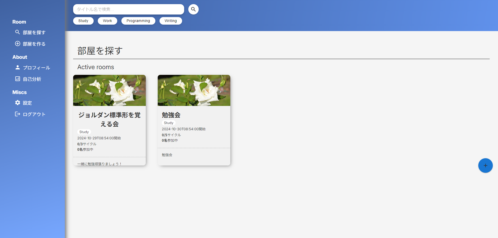
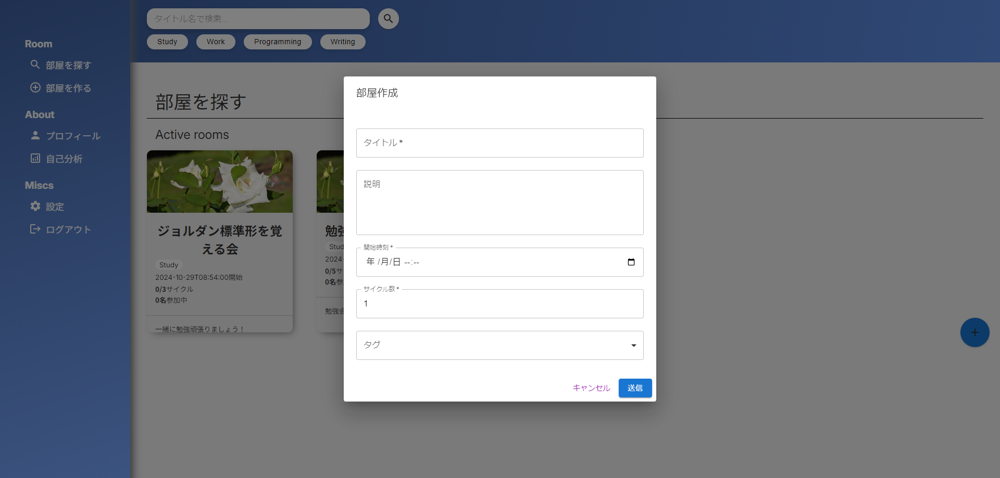
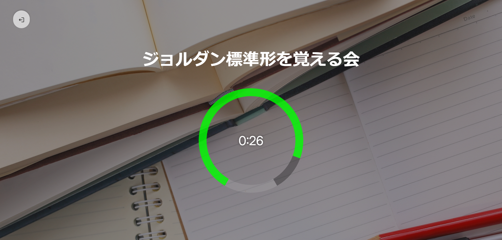
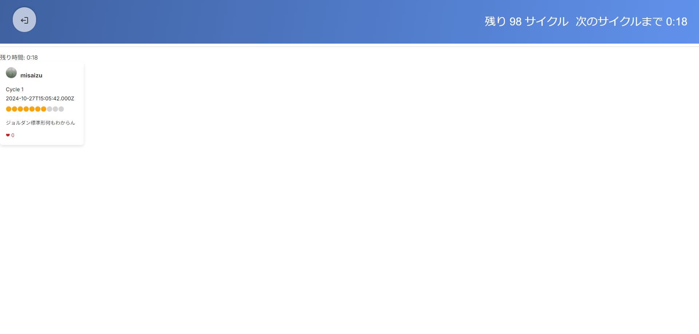
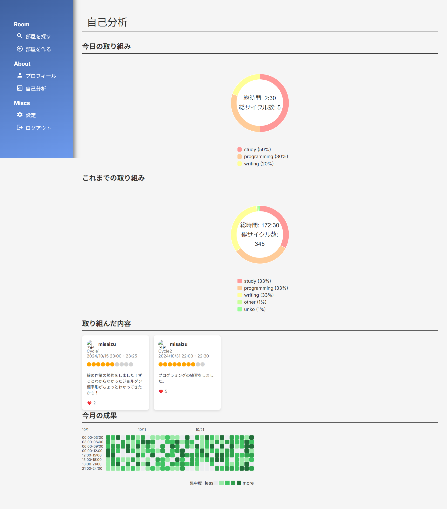
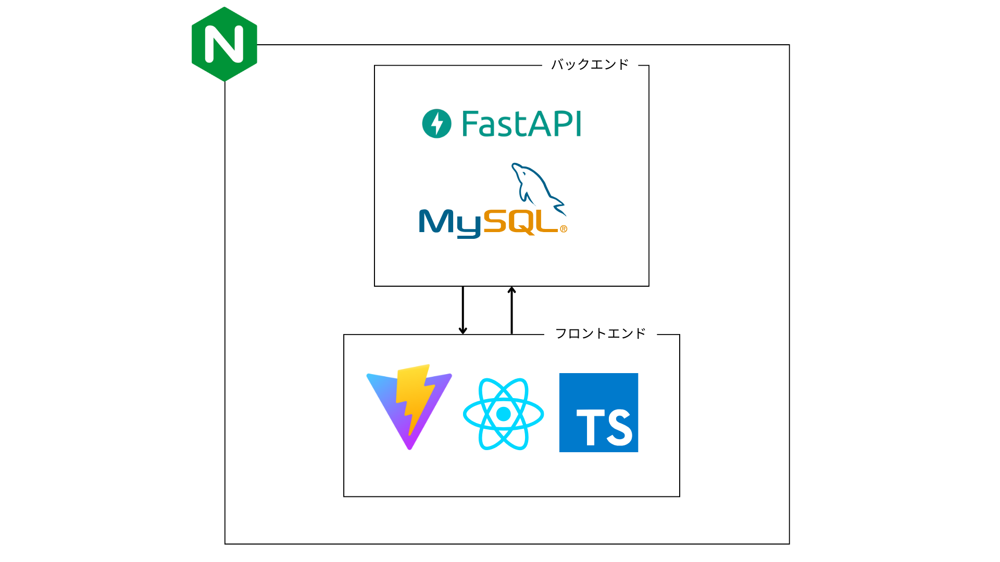

# ぽもとも

[デモはこちらから](http://34.121.150.190)

<video src="https://youtu.be/0uB6-KIObo4" controls="true"></video>
## 製品概要
### 背景(製品開発のきっかけ、課題等)
ポモドーロテクニックをご存じでしょうか？ポモドーロ法とは、「タスクの設定」、「25分間の作業」、「5分間の休憩」を1ポモドーロとして、ポモドーロサイクルを回すという時間管理の手法の一つです。これを何サイクルか繰り返すことで効率的に勉強・作業しようという手法です。
何度かやったことある方をいらっしゃるかと思いますが、このポモドーロテクニック、勉強時間が25分を過ぎてしまったり、休憩時間中についついスマホをいじってしまったりでサイクルが乱れてしまう経験をしたことがある方も多いかと思います。
そこで我々が提案するのがオンラインで他の人とポモドーロテクニックを実践するプラットフォーム「ぽもとも」です。
「ひとり」での学習は、多くの人々にとって苦痛です。「モチベーション維持の困難さ」、「一人での学習による孤独感と挫折リスク」、それらを解決すべく開発されました。「ぽもとも」を使うと、一緒に学びあえる仲間と巡り合い、目標に向けた継続的な学習を行うことができます！

### 製品説明（具体的な製品の説明）

ぽもともは、ポモドーロテクニックを活用したオンライン共同学習プラットフォームです。学習者同士がつながり、互いに刺激し合いながら学習を継続できる環境を提供します。
- 学習者マッチング機能
  ホーム画面では、現在稼働している入室可能なポモドーロ部屋に入ることができます。
  ユーザーは他のユーザーが作成した部屋に入ることで、同時にポモドーロテクニックを実践します。もちろん、部屋はどのユーザーでも作成することができます。 

- ポモドーロタイマーによる時間管理 
   ポモドーロ法の根幹である「25分間の作業」と「5分間の休憩」を強調するため、ページ画面にはそれぞれのタームの残り時間を表示します。単純にタイマをセットするのではなく、ポモドーロ部屋の開始時刻と現在時刻をセッションごとに比較することにより、より正確なタイマ機能を実現しています。作業時間中はシンプルなタイマーのみを表示することで集中を促し、他の画面要素は一切見せない工夫をしておます。

- 休憩時間中の進捗共有
   「25分間の作業」を終えると、進捗共有ページに遷移します。このページでは「進捗度合い」、「作業で取り組んだことの振り返り」を入力して送信します。作業の振り返りを休憩時間に行うことにより、全体を俯瞰した進捗状況の把握が可能であり、タスクの優先順位を見直すことで、タスクの重要な部分が明確になります。また、振り返りは現状の課題や問題点の把握につながります。また他の人が投稿した評価・コメントをリアルタイムで見ることができ、他の人の進捗を見ることで臨場感・モチベーションの向上につながります。他の人の投稿にはリアクションを付けることができ、ユーザー間の交流をより促しモチベーションの向上につなげています。 

自己分析ページでは過去に自分が参加したセッションの履歴・分析を見ることができます。参加した部屋の種類や、投稿した進捗コメントの一覧、以前に参加したセッションを履歴をgithubの草形式で見ることができます。

### 特長
#### 1.オンラインルーム機能による共同学習空間
- リアルタイムでの学習状況共有
- ポモドーロタイマーによる時間管理
- グループチャット,通話機能(今後の展望)
- リアクション機能による気軽なコミュニケーション

#### 2.コミュニティ形成支援機能
- 休憩時間中の進捗共有
- 学習者マッチング機能

#### 3.学習進捗の可視化
- カレンダー形式での学習記録表示
- 詳細な学習統計
- タグ付けによる学習内容の整理
- 過去の進捗メモの検索と閲覧

### 解決出来ること
- 学習開始のハードルを下げ、継続的な学習習慣の形成を支援
- オンライン学習における孤独感の軽減
- 仲間と一緒に学ぶ意識による学習モチベーションの向上
- 自己の学習パターンの把握と改善
- 具体的な成長の実感と効果的な学習方法の発見
- オンラインでの学習コミュニティ形成

### 今後の展望
- AI機能による個別最適化された学習支援
- 教育機関との連携
- グローバル展開によるクロスカルチャーな学習環境の提供
- 学習データ分析基盤の強化

### 注力したこと（こだわり等）
- タグによって作業の種類を分け、似た作業をしている人同士で集まれるように
- タグ・タイトルの部分一致検索により部屋の検索が可能
- 過去のセッション履歴を分析し、グラフ・githubの草形式で可視化
- 25分間の作業時間中はタイマーのみのシンプルな画面を映すことで、気がまぎれるのを防止し集中を促す
- WebSocketを活用し5分間の休憩時間中に進捗をリアルタイムで共有することで、他人と一緒に勉強している臨場感を出しモチベーションの向上につなげる
- 他人の進捗コメントにリアクションできるようにし、モチベーションの向上につなげる
- Material UIを活用した直感的なUI/UXデザイン

## 開発技術
### 活用した技術
#### API・データ
* 
* 

#### フレームワーク・ライブラリ・モジュール
フロントエンド
- React
- TypeScript
- Material UI
- Vite
- Recharts

バックエンド
- FastAPI
- SQLAlchemy
- Marshmallow
- WebSocket
- ULID
- opencv-python
- asyncio

データベース
- MySQL

サーバー関係
- Nginx
- Docker
- GCP Compute Engine

#### デバイス
* クロスプラットフォーム対応

Webブラウザ対応 (Chrome, Firefox, Safari)
~~レスポンシブデザイン対応~~ 

### 独自技術
#### ハッカソンで開発した独自機能・技術
フロントエンド
- 部分一致検索・タグ検索による部屋の検索機能
- WebSocketを利用し、立っている部屋のデータ・部屋内の進捗コメントをリアルタイムに同期
- Material-UIとRechartsを組み合わせた、セッションの分析データ可視化
- react-hook-formを利用し、不正な入力をフロントエンド側でブロック
- アカウントのログイン状況に応じて動的にルーティングを変更
- SCSSモジュールによるスタイリング管理

バックエンド
- ULIDを活用し、一意識別可能かつ高速にクエリ検索をかけられるように
- 422_UNPROCESSABLE_ENTITYのエラーハンドリングを実装し開発体験を向上

使用した効率的なORM実装
CORSミドルウェア統合
データモデリングとスキーマ設計
Marshmallowによるデータバリデーション
レスポンシブデザインの実装git 
